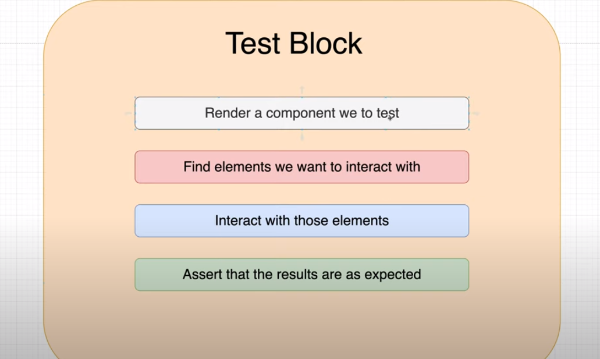
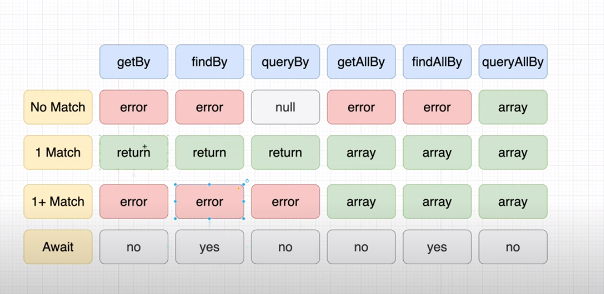
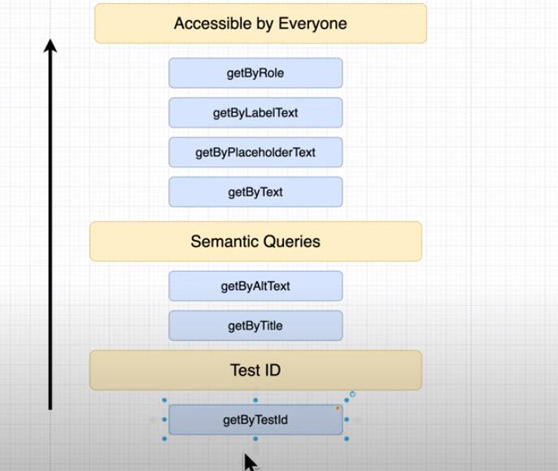

# Testing

## what is test?

+ asseriting our expectation with actual output.

## Why we need to do testing?

+ It helps with designing of our code and helps use and follow  the design principles standards.
+ It helps with finding bling spots and edeg cases we missed to handle.
+ It helps with maintaineance of our code, because when we do bug fixing, adding feature or refactoring our code, test ensure, we don't break our intention of the code when we write it.
+ It also helps with automation of tests.
+ also act as documentation of our code intention.

## how to test?

+ don't test the implementation details, only test the functionality.
+ test should be written in a way that our user uses our application.
+ code coverage is not indication of good test, because it don't indicate, is all usecases are covered? and which usecases are important than others?

P.S: We use jest and react testing library to test our react component
By default, jsdom will be used as mock testing environment, which replicate browser Api's

## Types of Test

+ Unit test - testing component or units in isolation
+ Integration test - ensuring every components work together and work together correctly in mock test environment
+ end-to-end test - simulating real user flows and ensuring everything works well.

## structure of test

+ Arrange - render the component
+ Act - take the component by query similar to how the user will do it, and do some interaction
+ Assert - assert your expectation with actual output.

## Why choose React Testing library?

+ it helps us enforce to test our component same way our user will use our app, with providing util methods
+ also enforce accesibility into our app via testing.

## React testing query methods

+ Get - error out if no matches found, error out if more than one match found, sync... 
+ Getall- error out if no matches found, return arrary if one match or more than one match found, sync
+ query - don't error out if no matches found, error out if more than one match found, sync
+ queryall - return array with elements if matches found or return empty array, sync
+ find - error out if no matches found, error out if more than one match found, async...    
+ findall - error out if no matches found, return arrary if one match or more than one match found, async

## Methods to use in React testing lib
